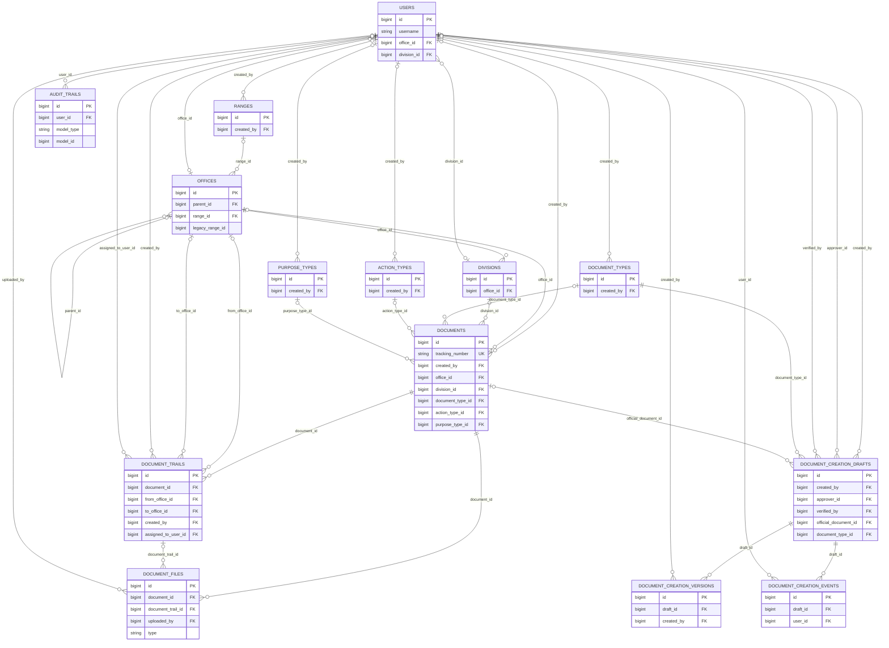
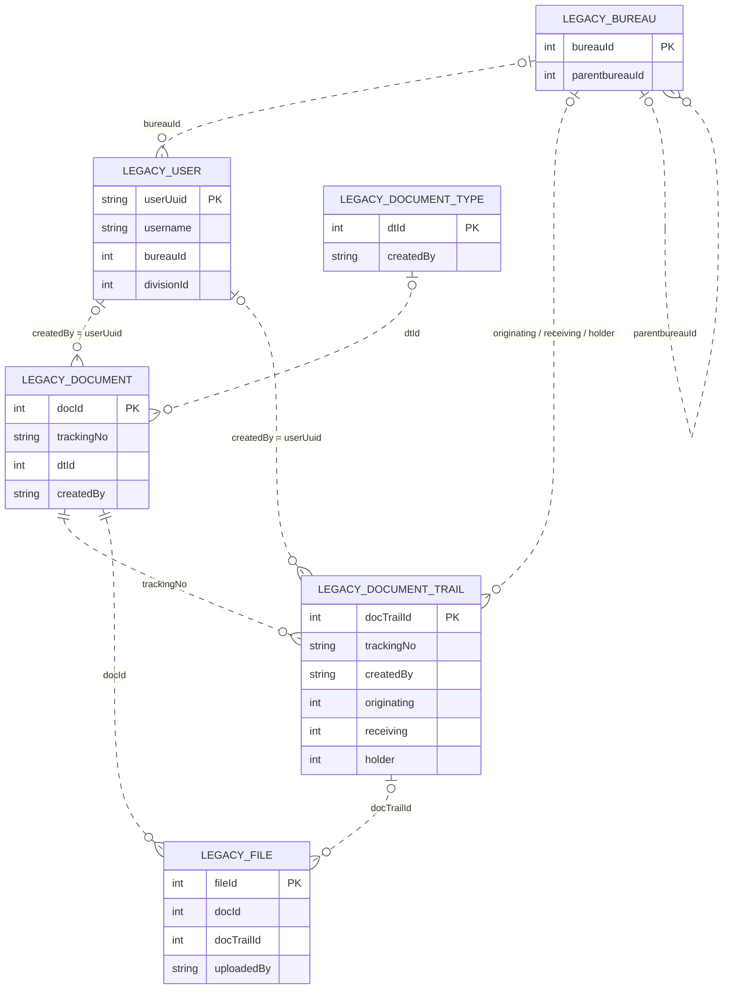

# Document, Trail, and User Relationships

This document describes the document-related tables used by the application in the legacy database and the current DOTS database. It covers ownership, routing, attachments, reference data, document-creation workflow, and audit events.

## Current DOTS database

`AUDIT_TRAILS.model_type` and `model_id` form a polymorphic target in application code. They can identify a document (for example, a `Document` model and its ID), but they are not a database foreign key and an audit event does not necessarily refer to a document.

## Current table guide

| Table | How it relates to documents, trails, or users |
|---|---|
| `users` | Local identity table. Its numeric `id` is used by the current document, trail, file, workflow, and audit tables. `office_id` and `division_id` associate a user with organizational records. |
| `documents` | One row per current DOTS document. `created_by` points to its creator; `office_id` and `division_id` identify organizational context; type/action/purpose IDs point to reference tables. |
| `document_trails` | Workflow/routing history for a document. `document_id` identifies the document; `created_by` identifies who recorded the entry; `assigned_to_user_id` optionally identifies the assigned user; `from_office_id` and `to_office_id` record routing offices. |
| `document_files` | Attachments associated with a document. `document_id` is required; `document_trail_id` optionally associates a file with a particular trail entry; `uploaded_by` optionally identifies the local uploader. `type` distinguishes original/version/other file categories. |
| `offices` | Organizational units associated with documents, users, and trail routing. `parent_id` supports an office hierarchy; `range_id` links the office to a current range. `legacy_range_id` is a legacy identifier, not a declared foreign key. |
| `divisions` | Belong to an office and can be associated with users and documents. |
| `ranges` | Organizational reference data associated with offices. `created_by` records the local user who created the range. |
| `document_types` | Reference data for document classification. A document may reference a type; `created_by` records who created the type. |
| `action_types` | Optional reference data for a document action. `created_by` records who created the action type. |
| `purpose_types` | Optional reference data for a document purpose. `created_by` records who created the purpose type. |
| `document_creation_drafts` | Pre-registration document workflow. `created_by`, `approver_id`, and `verified_by` identify local users; `official_document_id` optionally links a registered draft to its resulting row in `documents`. |
| `document_creation_versions` | Version snapshots belonging to a draft through `draft_id`; `created_by` optionally records the user who made a version. |
| `document_creation_events` | Activity history for a draft through `draft_id`; `user_id` optionally records the user responsible for an event. |
| `audit_trails` | General application audit events. `user_id` optionally identifies a local user; `model_type` / `model_id` may point to a document but are polymorphic values, not a declared foreign key. |

### Current relationship behavior

- A document has one optional creator and can have multiple trail entries and files.
- Each trail entry belongs to one document. Trail creators and assignees are separate user roles and may be different people.
- A file always belongs to a document in the current schema. It can additionally belong to one trail entry.
- A draft can optionally reference its registered current document through `official_document_id`. The schema does not make that reference unique, so it does not guarantee a one-to-one draft/document relationship. Draft versions and events remain linked to the draft, not directly to its registered document.
- Foreign keys marked nullable use `nullOnDelete` in the migrations. Deleting a referenced user, office, division, type, or trail can therefore leave the associated record without that optional reference. Deleting a document cascades to its document trails and document files.

## Legacy database

The dotted Mermaid relationships indicate logical joins/identifier references in the application, not confirmed database-enforced foreign keys. The legacy `file.uploadedBy` column is a string; the application schema/model evidence does not establish a guaranteed join from it to `userUuid` or `username`.

## Legacy table guide

| Table | How it relates to documents, trails, or users |
|---|---|
| `user` (`UserLegacy`) | Legacy identity table; primary key is string `userUuid`. It contains `bureauId` and `divisionId` organizational identifiers. |
| `document` (`DocumentLegacy`) | Legacy documents; primary key is `docId`. `createdBy` contains the legacy creator identifier; `trackingNo` associates it with trail rows; `dtId` identifies its document type. |
| `document_trail` (`DocumentTrailLegacy`) | Legacy workflow/routing history. The app joins it to documents by `trackingNo`; `createdBy` identifies the legacy actor; `originating`, `receiving`, and `holder` identify legacy bureaus. |
| `file` | Legacy attachments. It has `docId` and `docTrailId` identifiers, and contains file-name/path/type metadata. Public tracking loads files by `docId`. `uploadedBy` is a string and is not reliably mapped to a legacy user in the observed application code. |
| `document_type` (`DocumentTypeLegacy`) | Legacy document type lookup. The document list resolves `document.dtId` to `document_type.dtId`. |
| `bureau` (`BureauLegacy`) | Legacy office/bureau lookup. Trail routing identifiers resolve to `bureau.bureauId`; `parentbureauId` represents the legacy hierarchy. |
| `division` (`DivisionLegacy`) | Legacy division lookup; legacy users store `divisionId`. No document/trail division relationship is used in the current document-list joins described here. |

The application loads legacy trails for the selected documents by matching `trackingNo`, and resolves document/trail creator names by matching `createdBy` to `user.userUuid`. The legacy model definitions do not declare these Eloquent relationships, and the exact legacy database constraints may differ from the logical joins shown above.

## How legacy login connects to current DOTS records

When a legacy account successfully logs in, the application finds or creates a local `users` row by username (or email if needed), copies account details, saves it, and authenticates that local user. It copies the legacy bureau identifier to `users.legacy_office_id`, but does **not** save the legacy `userUuid` on that row.

Consequently:

- New DOTS documents, trail entries, file uploads, workflow events, and audit events record the local numeric `users.id`.
- Existing legacy documents and trail entries retain the legacy string user identifier in `createdBy`.
- There is no persistent local-user-to-legacy-user mapping in the current schema. Username matching at login is not a durable foreign-key relationship.
- `users.legacy_office_id` is an organizational link to the legacy bureau, not an identity link to `userUuid`.

To reliably associate a person's legacy document history with their new DOTS account, add and populate an explicit mapping, such as a unique nullable `legacy_user_uuid` on `users` or a dedicated user-identity mapping table. Then query legacy records using that mapping rather than assuming usernames are stable.

## Scope and schema notes

- The current ERD includes document-specific and directly supporting tables. Generic Laravel tables such as sessions, cache, and jobs are excluded because they are not document ownership/workflow relationships.
- The migration creates a local `bureaus` table, but the current document models use `offices`; legacy document routing is resolved against the legacy `bureau` table. `users.legacy_office_id` stores a legacy bureau ID without a declared foreign key to the external legacy database.
- Current reference tables `action_types` and `purpose_types` are included because current documents have nullable IDs to them. Legacy document type lookup is included because the legacy document list resolves `dtId`; other legacy reference fields may be represented as raw values.
- `document_trails` are workflow history. `audit_trails` are separate general audit events.

## Source files

- Current table definitions: `database/migrations/0001_01_01_000000_create_users_table.php`, `2026_09_23_000001_create_offices_table.php`, `2026_09_23_000002_create_divisions_table.php`, `2026_09_23_000003_create_document_types_table.php`, `2026_09_23_000004_create_action_types_table.php`, `2026_09_23_000005_create_purpose_types_table.php`, `2026_09_23_000006_create_documents_table.php`, `2026_09_23_000007_create_document_trails_table.php`, `2026_09_23_000008_create_document_files_table.php`, `2026_09_23_000009_create_audit_trails_table.php`, and `database/migrations/2026_10_01_000001_create_document_creation_workflow_tables.php`.
- File trail/version fields: `database/migrations/2026_10_08_000001_add_file_version_metadata_to_document_files_table.php`.
- Current models: `app/Models/User.php`, `Office.php`, `Division.php`, `Document.php`, `DocumentTrail.php`, `DocumentFile.php`, `DocumentType.php`, `ActionType.php`, `PurposeType.php`, `DocumentCreationDraft.php`, `DocumentCreationVersion.php`, `DocumentCreationEvent.php`, and `AuditTrail.php`.
- Legacy models: `app/Models/UserLegacy.php`, `DocumentLegacy.php`, `DocumentTrailLegacy.php`, `DocumentTypeLegacy.php`, `BureauLegacy.php`, and `DivisionLegacy.php`.
- Legacy-to-local provisioning: `app/Http/Requests/Auth/LoginRequest.php`.
- Combined document/trail listing: `app/Http/Controllers/DocumentController.php`.
- Legacy public-tracking file lookup: `app/Http/Controllers/PublicDocumentTrackingController.php`.
